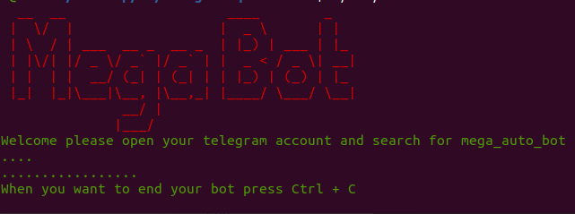
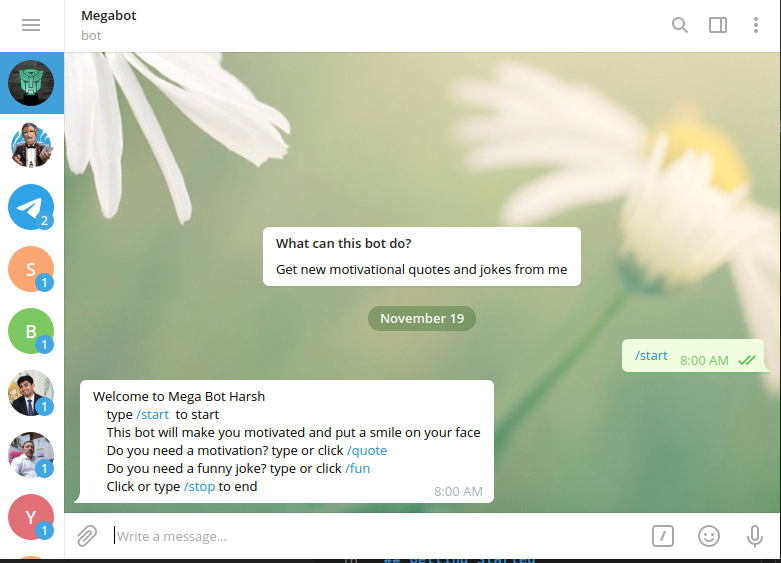

# Telegram Bot

> A telegram bot that gets you quotes and jokes. The bot is built in Ruby and by using telegram bot gem and quotes are fetched from the zenquotes API and jokes from a predefined list.

## Built With

- Ruby
- Bundler gem

## Loom Demo

https://www.loom.com/share/461a5ee1ec2c4a47aaaed690e039dd8b

## Getting Started

To get a local copy up and running follow these simple example steps.

### Prerequisites

- Ruby 
- Bundler gem installed

### Setup

- clone this repo from github

### Install

- cd into the root directory
- run `bundle install` in root directory

### Usage

- run `./bin/main.rb` in your shell from the root directory to start the bot
- check telegram and find bot by searching `@mega_auto_bot`

### Run tests

- run `rspec` in root directory to run tests

### Telegram Account creation
You can see this blog to install telegram in iPhone or android

[How to create a telegram account](https://www.indiatoday.in/information/story/how-to-create-telegram-account-1617921-2019-11-11)

## Author

👤 **Harshdeep Kanhai**

- GitHub: [@harshdeepkanhai](https://github.com/harshdeepkanhai)
- Twitter: [@harshdeepkanhai](https://twitter.com/harshdeepkanhai)
- LinkedIn: [harshdeepkanhai](https://linkedin.com/in/harshdeepkanhai)

## 🤝 Contributing

Contributions, issues, and feature requests are welcome!

Feel free to check the [issues page](issues/).

## Show your support

Give a ⭐️ if you like this project!

## Acknowledgments

- Ruby Gem Telegram Bot
- zenquotes API
- Microverse

## 📝 License

This project is [MIT](lic.url) licensed.
